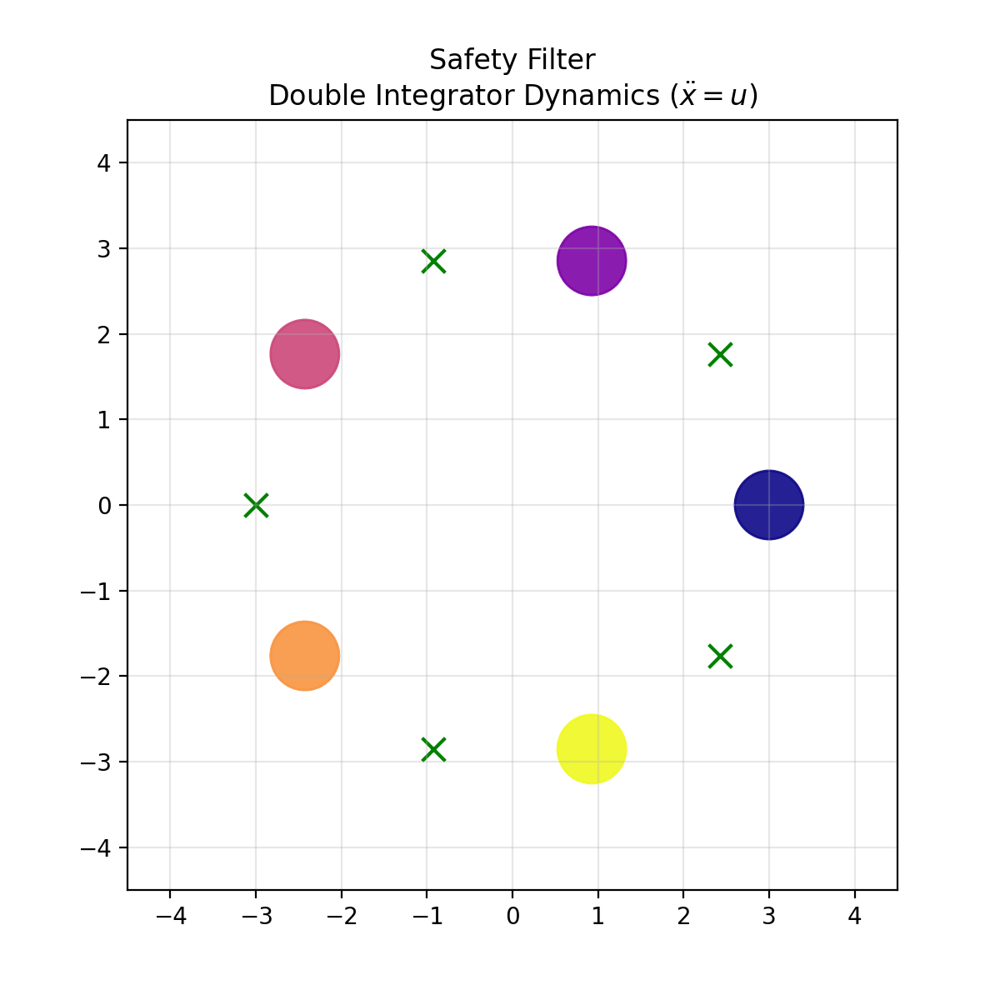
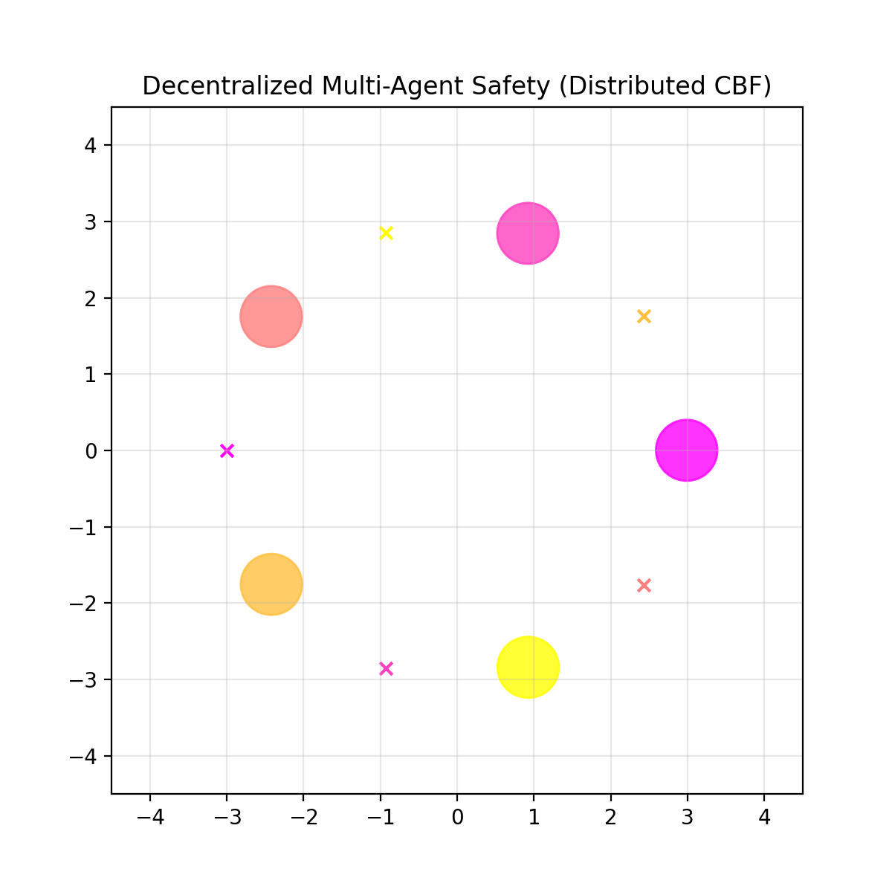

# Safe Swarm Control with High-Order CBF

**Evolution of Safety:** From Centralized Optimization to Decentralized Swarm Control under Inertial Dynamics.

[](https://www.python.org/)
[](https://opensource.org/licenses/MIT)
[](https://github.com/)

## 📖 Abstract
This project implements safety-critical control architectures for multi-agent systems modeled with **Double Integrator dynamics** ($\ddot{x}=u$). Unlike simple kinematic models, this project addresses physical inertia and braking limitations, solving the **"Relative Degree 2"** challenge using **High-Order Control Barrier Functions (HO-CBF)**.

The repository documents the engineering evolution of the system in two phases:
1.  **Phase 1 (Baseline):** A **Centralized Safety Filter** using a single global Quadratic Program (QP).
2.  **Phase 2 (Swarm):** A **Decentralized Framework** utilizing cooperative constraint splitting for $O(N)$ scalability and robustness.

---

## 🚀 Phase 1: Centralized Safety Filter
In the initial iteration, the safety problem is formulated as a single, global optimization problem. A central computer possesses perfect knowledge of all agents' states and computes optimal control inputs simultaneously.

* **Methodology:** A centralized QP modulates the output of a noisy, learning-based nominal policy to guarantee collision-free trajectories.
* **Limitation:** The solver complexity grows cubicly ( $O(N^3)$ ), making real-time computation impossible for large swarms ($N > 50$).

> **Visual Demo:**
>
> 
>
> *Centralized solver coordinating agents in a circle swap scenario.*

---

## ✨ Phase 2: Decentralized Swarm Control (The Solution)
To address the scalability and single-point-of-failure issues of the centralized approach, the architecture was evolved into a decentralized swarm system.

* **Distributed Compute:** Each agent solves its own local QP, relying only on observations of immediate neighbors.
* **Constraint Splitting:** Agents do not negotiate. Instead, each agent assumes responsibility for **50%** of the required safety maneuver. This cooperative assumption ensures global safety without explicit communication.
* **Scalability:** The system scales linearly ( $O(N)$ ), allowing for large-scale swarms without performance degradation.

> **Visual Demo:**
>
> 
>
> *Decentralized agents navigating safely with local sensing only.*

---

## 📊 Architecture Comparison

| Feature | Phase 1: Centralized | Phase 2: Decentralized |
| :--- | :--- | :--- |
| **Solver Complexity** | $O(N^3)$ (Single Global QP) | $O(N)$ (Parallel QPs) |
| **Communication** | Global (All-to-One) | Local (Neighbor-to-Neighbor) |
| **Failure Mode** | Critical (System-wide) | Localized |
| **Safety Mechanism** | Global HO-CBF | Cooperative Constraint Splitting |

---

## 🧠 Theoretical Background

### 1. The Relative Degree Challenge
Standard Control Barrier Functions (CBF) fail for systems with inertia (Double Integrator) because the control input $u$ (acceleration) does not appear in the first derivative of the position-based barrier function $h(x)$.

### 2. High-Order CBF Formulation
To enforce forward invariance of the safety set $C$, we utilize the High-Order CBF condition developed by Xiao & Belta:

$$
\ddot{h}(x) + (\alpha_1 + \alpha_2)\dot{h}(x) + \alpha_1\alpha_2 h(x) \ge 0
$$

### 3. Cooperative Constraint Splitting (Decentralized)
In Phase 2, the safety constraint is split. Agent $i$ ensures:

$$
2\Delta p_{ij}^T u_i \ge \frac{1}{2} \left( -2||\Delta v_{ij}||^2 - (\alpha_1+\alpha_2)\dot{h} - \alpha_1\alpha_2 h \right)
$$

This ensures that if both Agent $i$ and Agent $j$ satisfy their local constraints, the global safety condition is met.

---

## 🛠️ Installation & Usage

### Prerequisites
The project requires Python and the following libraries (specifically `cvxpy` for convex optimization):

```bash
pip install -r requirements.txt

```

### Running the Simulations

**1. Run Centralized Baseline (Phase 1):**

```bash
python run_centralized.py

```

**2. Run Decentralized Swarm (Phase 2):**

```bash
python run_decentralized.py

```

---

## 📚 References & Acknowledgments

**Author:** Suleyman Talha Belen

This project relies on theoretical frameworks established in the following papers:

* **High-Order CBF:** Xiao, W., & Belta, C. (2019). *Control Barrier Functions for Systems with High Relative Degree*. Proc. of 58th IEEE CDC. [Basis for Eq. 5 in code]
* **CBF Theory:** Ames, A. D., et al. (2019). *Control Barrier Functions: Theory and Applications*.
* **Solver:** This project utilizes [CVXPY](https://www.cvxpy.org/) with the OSQP solver for real time optimization.

---

*This repository serves as a portfolio project demonstrating experience in Safety-Critical Control, Convex Optimization, and Multi-Agent Systems.*
